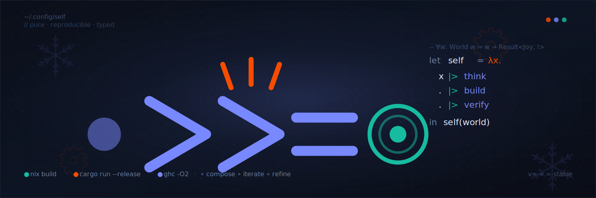
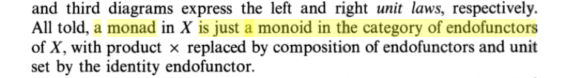

  

<h1 align="center">Hi there 👋</h1>

  Welcome to my GitHub page. This is where you can see what I'm currently working on. Have a look around!

  You can check out my showcase projects over on <a href="https://github.com/MPM-Labs">MPM-Labs</a>

  <a href="#who-am-i">Who am I</a> •
  <a href="#focus--philosophical">Philosophy</a> •
  <a href="#focus--concrete">Current Focus</a> •
  <a href="#work">Work</a> •
  <a href="#technologies-i-use-or-have-used">Tech</a>

---

## Who am I?

My name is **Jonas** and I am a software engineering student at **Oslo Metropolitan University**.

I love understanding how things work, and can never stop myself from investigating something I don't understand.

In addition to attending OsloMet, I am also the corporate contact and event manager at [**Ditio**, the student association for IT students](https://www.linkedin.com/company/ditio-linjeforening).

---

## Focus — concrete

Currently, I am learning **Rust**. I like its unique position as a fast, compiled language with safeguards you would often only find in slower, interpreted languages.

I am also trying to learn more about **functional languages**. This is not just about efficiency in terms of raw execution speed, but about efficiency in terms of development time. Functional programming offers guarantees like safe concurrency, testability and more. Even if I don't end up working with it daily, it's worth learning. I use **Haskell**. On the side, I'm reading [Category theory for programmers by Bartosz Milewski](https://bartoszmilewski.com/2014/10/28/category-theory-for-programmers-the-preface/).

   
  <em>"A monad is just a monoid in the category of endofunctors."</em> 
  — Saunders Mac Lane, <em>Categories for the Working Mathematician</em> (1971)

Nix deserves its own mention. It's a purely functional language drawing heavily on Haskell for its inspiration. It is, however, not primarily intended as a general purpose language. It is Turing complete, but its purpose is declaring and defining packages, system configurations, development environments, and much more. In general it provides a lot of great tooling involved in software development. I use it for all my projects, as well as for configuring all my machines, which run [NixOS](https://nixos.org/) (a Linux distro based on the Nix package manager that is used with the Nix programming language).

<strong>🔧 My current Nix deep-dive (click to expand)</strong>

 

Recently I've been focusing on the practical use cases of Nix. My [portfolio page](https://jonas.baugerud.no) serves as a real-world test bed for a full Nix-based pipeline:

1. **Build** — The site is written in Rust using [Leptos](https://www.leptos.dev/). Nix builds the binary and all static assets reproducibly. Same inputs, same outputs, every time — like Docker, but more deterministic.
2. **Package** — The build output is wrapped in a **NixOS module** that declares exactly how to run it, with configurable options for tweaking behavior.
3. **Test** — The module runs inside a NixOS VM, letting me validate the full server environment before it ever touches production. This also enables automated integration tests with virtual servers and clients.
4. **Deploy** — [My own deployment tool](https://github.com/MPM-Labs/nixos-deployment-template) handles server bootstrapping, updates, and secrets management via GitHub Actions and environment secrets. Binary caching bridges source and binary deployment, keeping build times low on resource-constrained servers.

As a bonus, Nix gives me deterministic, language-agnostic dev environments that live in the Git repo and work identically for every contributor.

Simply put, **Nix is incredible.**

---

## Focus — philosophical

Good software accounts for ethical, societal and practical considerations. It's not only functional, but also maintainable and well documented — able to evolve with the client's needs and be passed to other developers with little friction.

I have a great interest in finding *"proper"* solutions to problems. More and more I find myself preferring expert books and official documentation over less formal sources like blogs or guides. That's not to take away from the wonderful part of the software world that is sharing and helping each other. It's just important to verify against official sources — otherwise you hit pitfalls like security holes and solutions that only work _sometimes_.

I care about efficiency. Modern hardware is fast, but energy consumption and scalability still matter, and I find it more satisfying to work in compiled, statically-typed languages where sloppiness has less room to hide. This will likely explain many of the technologies, languages and techniques I prefer using in my work.

---

## Work

> 💼 **I'm actively looking for a job opportunity within software engineering.**

I'm especially interested in roles involving Rust, systems programming, or infrastructure/tooling — but I'm open to anything where correctness and craftsmanship matter.

  
  

---

## Technologies I use or have used

### 🟢 Languages I know well

<table>
  <tr>
    <td align="center" width="80"> <b>Rust</b></td>
    <td>My personal go-to. Can be used for almost anything, from low level systems to web servers. I even use it to compile WASM for my portfolio website.</td>
  </tr>
  <tr>
    <td align="center"> <b>Nix</b></td>
    <td>More tooling-oriented. I use it in all my projects. It packages software and guarantees correct deployment.</td>
  </tr>
  <tr>
    <td align="center"> <b>Bash</b></td>
    <td>Always useful.</td>
  </tr>
  <tr>
    <td align="center"> <b>PostgreSQL</b></td>
    <td>You can do remarkably powerful things with SQL and PL/pgSQL.</td>
  </tr>
  <tr>
    <td align="center"> <b>Python</b></td>
    <td>For quick prototyping and university courses.</td>
  </tr>
  <tr>
    <td align="center"> <b>Java</b></td>
    <td>The main language taught at university.</td>
  </tr>
  <tr>
    <td align="center"> <b>HTML</b></td>
    <td>Always important to keep the basics in mind.</td>
  </tr>
  <tr>
    <td align="center"> <b>CSS</b></td>
    <td>I prefer writing my own CSS (SCSS) instead of using tools like Tailwind. That being said, design is not my main focus.</td>
  </tr>
  <tr>
    <td align="center"> <b>JavaScript</b></td>
    <td>Unavoidable in web work — though I reach for Rust + WASM when I can.</td>
  </tr>
</table>

### 📚 Languages I'm learning

<table>
  <tr>
    <td align="center" width="80"> <b>Rust</b></td>
    <td>Currently working on async understanding.</td>
  </tr>
  <tr>
    <td align="center"> <b>Nix</b></td>
    <td>Currently working through chapter 5 of <a href="https://edolstra.github.io/pubs/phd-thesis.pdf">the thesis</a>.</td>
  </tr>
  <tr>
    <td align="center"> <b>Bash</b></td>
    <td>I often bump into commands I haven't used before and try to get familiar with as many as possible. (technically I use zsh)</td>
  </tr>
  <tr>
    <td align="center"> <b>Haskell</b></td>
    <td>Currently reading <a href="https://people.cs.nott.ac.uk/pszgmh/pih.html">Programming in Haskell and [Category theory for programmers by Bartosz Milewski](https://bartoszmilewski.com/2014/10/28/category-theory-for-programmers-the-preface/)</a>.</td>
  </tr>
  <tr>
    <td align="center"> <b>WASM</b></td>
    <td>I am developing my portfolio site that runs on <a href="https://www.leptos.dev/">Leptos</a>, but would like to learn more about WASM itself.</td>
  </tr>
</table>

### 🛠️ Tooling I use

<table>
  <tr>
    <td align="center" width="80"> <b>Docker</b></td>
    <td>Mostly when collaborating with others. In my personal projects, Nix has replaced Docker.</td>
  </tr>
  <tr>
    <td align="center"> <b>Figma</b></td>
    <td>Prototyping UIs.</td>
  </tr>
  <tr>
    <td align="center"> <b>Actions</b></td>
    <td>Love this! Allows a ton of automation and free jobs on public repos.</td>
  </tr>
  <tr>
    <td align="center"> <b>Linux</b></td>
    <td>I run NixOS (btw).</td>
  </tr>
  <tr>
    <td align="center"> <b>Maven</b></td>
    <td>University work.</td>
  </tr>
  <tr>
    <td align="center"> <b>Nginx</b></td>
    <td>Or Caddy. TLS and reverse proxying between sites.</td>
  </tr>
  <tr>
    <td align="center"> <b>Postman</b></td>
    <td>Manual HTTP testing.</td>
  </tr>
  <tr>
    <td align="center"> <b>Redis</b></td>
    <td>Caching and refresh token storage.</td>
  </tr>
  <tr>
    <td align="center"> <b>Spring</b></td>
    <td>University work.</td>
  </tr>
  <tr>
    <td align="center"> <b>Vite</b></td>
    <td>We use it to build the frontend of the student association's website.</td>
  </tr>
</table>

### 🎯 Tooling I want to learn

<table>
  <tr>
    <td align="center" width="80"> <b>Bevy</b></td>
    <td>Game development in Rust.</td>
  </tr>
  <tr>
    <td align="center"> <b>Neovim</b></td>
    <td>Next time I have a couple years to spare.</td>
  </tr>
</table>

### 📦 Technologies I've tried or used in the past

<table>
  <tr>
    <td align="center"> <b>K8s</b></td>
    <td>Ran my own GitHub Actions Runner Controller once (but this is a bit overkill and unnecessary).</td>
  </tr>
  <tr>
    <td align="center"> <b>Processing</b></td>
    <td>This is where I'd say I learned to program.</td>
  </tr>
  <tr>
    <td align="center"> <b>Tailwind</b></td>
    <td>Have tried it, prefer SCSS personally.</td>
  </tr>
  <tr>
    <td align="center"> <b>Arduino</b></td>
    <td>Have had some hobby interest in electronics.</td>
  </tr>
  <tr>
    <td align="center"> <b>SketchUp</b></td>
    <td>Useful for simple design, like apartment plans or simple 3D prints.</td>
  </tr>
</table>
